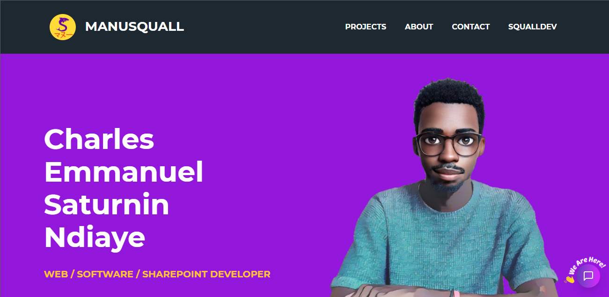

<!-- Repository git : https://github.com/ManuSquall/QIUM-project -->
# ManuSquall

<!-- Description -->
Just a kind of portfolio/playground website made with ASP.NET 5

<!-- ## Context -->
<!-- Why am i making this -->

## Tools used
<!-- Packages, external librairies, IDE, utilitaries used -->
* [VS Code](https://code.visualstudio.com/)
* [Visual Studio](https://visualstudio.microsoft.com/fr/downloads/)

<!-- ## How does it work -->
<!-- What we have to do to make it work/run -->

<!-- ## Output: -->

<!-- What the result is supposed to be -->

## About Authors / Contributors

[ManuSquall](https://manusquall.azurewebsites.net/)

## License

This project is licensed under the [CC0 1.0 Universal](https://creativecommons.org/) Creative Commons License.

## Acknowledgments

<!-- inspiration, research stuff -->
* https://github.com/dotnet/runtime/issues/34699#issuecomment-611094892

# Made with purple 💜 lust :-)